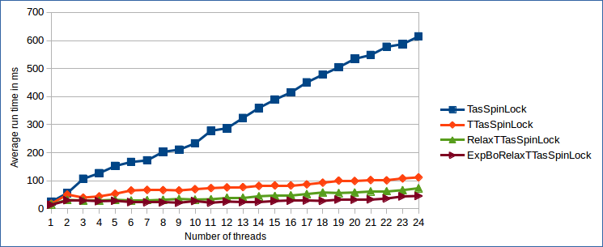

In my [previous blog post](https://geidav.wordpress.com/2016/03/12/important-properties-of-spinlocks/) I wrote about the most important properties of spinlocks and why they matter. This time I'll present the first out of three concrete spinlock implementations in C++11 for x86 processors. I'm assuming that you've read the first post. You can find all source code in this [Github](https://github.com/geidav/spinlocks-bench) repository.

# Introduction
The *Test-And-Set* (*TAS*) *Lock* is the simplest possible spinlock implementation. It uses a single shared memory location for synchronization, which indicates if the lock is taken or not. The memory location is updated using a `test-and-set` (`TAS`) operation. `TAS` *atomically* writes to the memory location and returns its old value in a single indivisible step. Actually, the name *test-and-set* is a little misleading, because the caller is responsible for testing if the operation has succeeded or not. The TAS Lock is not fair as it doesn't guarantee FIFO ordering amongst the threads competing for the lock. 

In C++11 `std::atomic_bool::exchange()` can be used to perform a `TAS` operation on an `std::atomic_bool` synchronization variable. On x86 CPUs `std::atomic::exchange()` is turned into the `LOCK XCHG` instruction (side note: the `LOCK` prefix is implicit and not strictly required, because there's no non-atomic version of `XCHG`). The following code implements the described TAS Lock.

```cpp
class TasSpinLock
{
public:
    ALWAYS_INLINE void Enter()
    {
        // atomic_bool::exchange() returns previous value of Locked
        while (Locked.exchange(true, std::memory_order_acquire) == true);
    }

    ALWAYS_INLINE void Leave()
    {
        Locked.store(false, std::memory_order_release);
    }

private:
    alignas(CACHELINE_SIZE) std::atomic_bool Locked = {false};
};

static_assert(sizeof(TasSpinLock) == CACHELINE_SIZE, "");
``` 

The `TasSpinLock::Locked` flag is cache line size padded using `alignas` to prevent *false sharing*. You can remove the padding, e.g. in memory-limited environments, when false sharing is not an issue.

# The test-and-test-and-set optimization
While the TAS Lock is extremely easy to implement, its scalability is very bad. Already with just a few threads competing for the lock, the amount of required cache line invalidations to acquire/release the lock quickly degrades performance. The problem is two-fold.

1. `std::atomic_bool::exchange()` always invalidates the cache line `Locked` resides in, regardless of whether it succeeded in updating `Locked` or not.
2. When the spinlock is released, all waiting threads simultaneously try to acquire it. This is sometimes referred to as *Thundering Herd* problem. Acquiring the lock means first invalidating the cache line copy of all threads waiting for the lock and then reading the valid cache line copy from the core which released the lock. With `t` threads this results in `O(t)` memory bus transactions.

The latter issue is inherent to TAS Locks, because just a single synchronization variable is used and shared between all threads. However, the first issue can be fixed by testing if the lock is free before calling `exchange()`. First testing if the lock is free only loads the synchronization variable and therefore doesn't cause a cache line invalidation. This spinlock variant is called *Test-And-Test-And-Set* (*TTAS*) Lock. The improved `Enter()` method looks like this:

```cpp
ALWAYS_INLINE void TTasSpinLock::Enter()
{
	do
		WaitUntilLockIsFree();
    while (Locked.exchange(true, std::memory_order_acquire) == true);
}

ALWAYS_INLINE void TTasSpinLock::WaitUntilLockIsFree() const
{
    while (Locked.load(std::memory_order_relaxed) == true);
}
```

# Exponential back-off
The TTAS Lock successfully reduces the amount of cache line invalidations occurring while the lock is trying to be acquired. However, as soon as the lock is released, again all threads try to update the `Locked` flag. If a thread sees that the lock is free, but fails acquiring it subsequently because some other thread was faster, the lock is most probably under high contention. In this situation it can help to wait for a short time to let other threads finish before trying to enter the critical section (CS) again.

Waiting a short time without trying to acquire the lock reduces the number of threads simultaneously competing for the lock. The larger the number of unsuccessful retries, the higher the lock contention and the longer the thread should back-off. Experiments have shown that a good strategy is to back-off exponentially; similar to the congestion avoidance mechanism used in the Ethernet protocol. To avoid threads running in *lock step* the initial wait time is randomized.

```cpp
ALWAYS_INLINE static void BackoffExp(size_t &curMaxIters)
{
	assert(curMaxIters > 0);
    
    thread_local std::uniform_int_distribution<size_t> dist;
    thread_local std::minstd_rand gen(std::random_device{}());
    const size_t spinIters = dist(gen, decltype(dist)::param_type{0, curMaxIters});
    
    curMaxIters = std::min(2*curMaxIters, MAX_BACKOFF_ITERS);
    for (volatile size_t i=0; i<spinIters; i++); // Avoid being optimized out!
}

ALWAYS_INLINE void ExpBoTTasSpinLock::Enter()
{
    size_t curMaxIters = MIN_BACKOFF_ITERS;

    while (true)
    {
        // Not strictly required but doesn't hurt
        WaitUntilLockIsFree();

        if (Locked.exchange(true, std::memory_order_acquire) == true)
            BackoffExp(curMaxIters); // Couldn't acquire lock => back-off
        else
            break; // Acquired lock => done
    }
}
```

The downside of waiting is that it renders the lock even unfairer than it is already. Threads that have been attempting to acquire the lock longest are also backing-off longest. Consequently, newly arriving threads have a higher chance to acquire the lock than older threads. On top of that threads might back-off for too long, causing the CS to be *underutilized*. Furthermore, there are unfortunately no single best values for `MIN_BACKOFF_ITERS` and `MAX_BACKOFF_ITERS`. Optimally, they're determined experimentally depending on the  workload (contention, size of CS).

# Pausing and sleeping
There are two more improvements we can do. First, according to the Intel Architectures Optimization Reference Manual, adding a `PAUSE` instruction to the body of all spin loops improves performance on Pentium 4 CPUs and later. The `PAUSE` instruction provides a hint to the CPU that the code being executed is a spin-wait loop. `PAUSE` is backwards compatible and turns into a `NOP` instruction on older CPUs. There are three reasons why using `PAUSE` improves performance:

* It avoids *memory order violations* which result in expensive *pipeline flushes*, because the CPU doesn't go ahead to fill its pipeline with speculatively executed load and compare instructions.
* It gives the other hardware thread time to execute on *simultaneous multi-threading* (SMT) processors (e.g. Intel's Hyper Threading).
* It adds a slight delay to the spin loop, which synchronizes it with the system's memory bus frequency. This frequency is typically much lower than the frequency of the CPU, which in turn reduces power consumption considerably.

The second improvement is to stop spinning, put the thread to sleep and reschedule if the the lock doesn't become available after some time. The important bit here is to not yield (`sched_yield()` on Linux, `SwitchToThread()` on Windows, or more generally `std::this_thread::yield()` in C++11), but to explicitly put the thread to sleep for a short period of time. This ensures that the thread is really paused for some time and isn't immediately run again by the scheduler if there's no other thread available in the scheduler's run queue. This is especially important on SMT processors where every two logical cores share most of the execution units. Only when the thread is really sleeping the other logical core can fully make use of the shared execution units. The following TTAS Lock implementation uses the `PAUSE` instruction and sleeps for 500us if the lock isn't released within `MAX_WAIT_ITERS` iterations. There's no single best value for `MAX_WAIT_ITERS`. Ideally, it's chosen experimentally like the `MIN_BACKOFF_ITERS` and `MAX_BACKOFF_ITERS` constants from before.

```cpp
ALWAYS_INLINE static void CpuRelax()
{
#if (COMPILER == MVCC)
    _mm_pause();
#elif (COMPILER == GCC || COMPILER == LLVM)
    asm("pause");
#endif
}

ALWAYS_INLINE static void YieldSleep()
{
    // Don't yield but sleep to ensure that the thread is not
    // immediately run again in case scheduler's run queue is empty
    using namespace std::chrono;
    std::this_thread::sleep_for(500us);
}

ALWAYS_INLINE static void BackoffExp(size_t &curMaxIters)
{
    ... Unchanged code not repeated, look above ...
    
    for (size_t i=0; i<spinIters; i++)
        CpuRelax();
}

ALWAYS_INLINE void ExpBoRelaxTTasSpinLock::WaitUntilLockIsFree() const
{
	size_t numIters = 0;

    while (Locked.load(std::memory_order_relaxed))
    {
    	if (numIters < MAX_WAIT_ITERS)
        {
            CpuRelax();
            numIters++;
        }
        else
        	YieldSleep();
    }
}
```

# Performance comparison
The benchmark used to compare the different TAS Lock variants is extremely simple and should be taken with a grain of salt. It launches `t` threads, each competing for the lock and incrementing a global atomic counter inside the CS. This causes high lock contention, because all threads are trying to enter the lock at the same time. Though, it's important to keep in mind that due to the lock's lack of fairness, it's entirely possible that the same thread acquires the lock multiple times in a row. I ran the benchmark on a dual socket NUMA system with two Intel Xeon E5-2630 v2 CPUs with 2.60 GHz. The CPUs support Hyper Threading which gives a total of 12 physical and 24 logical cores. The benchmark results are shown below.



The most interesting finding is that the amount of lock reacquisitions is a lot higher than I anticipated. This can be derived from the fact that all TTAS-based locks scale almost linearly, where typically the observed drop in performance for `TAS`-based locks is exponential. Large numbers of lock reacquisitions by the same thread reduces the amount of cache line invalidations and increases throughput. At the same time the latency of all other threads goes up, because they're granted the lock later.

The `TasSpinLock` scales so much worse, even though lock reacquisiton happens, because while spinning the `TAS` operation causes cache line invalidations also if it doesn't succeed in acquiring the lock. By looking at the difference between the `TasSpinLock` and the other TTAS-based versions, it's highly visible how big the influence of cache line invalidations is on the lock's performance.

# Wrapup
The exponential back-off TTAS Lock tends to perform fairly well as long as the number of competing threads is low or lock reacquisitions boost throughput while increasing latency. It's especially useful when it's not known a priori that the number of competing threads is bounded by the number of cores in the system (in that case better scaling spinlock variants perform really badly as we'll see in the next post). Beyond that, without padding the TTAS Lock just needs a single byte. The compact representation is useful in extremely memory-constrained environments or applications that require vast amounts of spinlocks; e.g. for fine-grained locking of lots of small pieces of data.