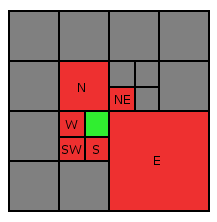
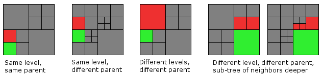
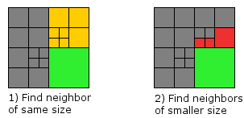
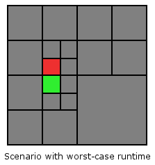

# Finding neighbor nodes in Quadtrees

## Introduction

This part of the Advanced Octrees series is about how to access neighbor nodes in Quadtrees. The algorithm can be naturally extended to Octrees, but it's easier to understand and code in just two dimensions. Neighbors are such nodes that either share an edge in horizontal (west, east) or vertical (north, south) direction, or that share a vertex in one of the four diagonal directions (north-west, north-east, south-west, south-east). See the figure below for an illustration. The node of which we want to find the neighbors is colored green. In the following this node is called *source node*. The neighbor nodes are colored red and labeled with the corresponding direction.



In the literature Quadtree neighbor finding algorithms are distinguished by two properties:

1. Does the algorithm operate on pointer-based Quadtrees or on linear Quadtrees? Read up on different Quadtree representations in the [second article](https://geidav.wordpress.com/2014/08/18/advanced-octrees-2-node-representations/) of this series. The algorithm discussed in this post is based on a pointer representation.
2. Can the algorithm only find neighbors of equal or greater size, or can it also find neighbors of smaller size. We'll see later that finding neighbors of smaller size is somewhat harder.

The figure below shows examples of neighbor relationships in north direction between nodes on different tree levels. Note, that a node can have more than one neighbor per direction if the sub-tree on the other side of the north edge is deeper than the sub-tree of the source node (cf. the two examples on the right).



## Algorithm

The input to the algorithm is a direction and an arbitrary Quadtree node (inner of leaf). The output is a list of neighbor nodes in the given direction. The neighbors can be of greater size, equal size or smaller size (see previous figure). The algorithm is symmetric with respect to the direction. That's why I only show an implementation for the north direction. It should be easy to extend the implementation to the other seven directions.

The neighbor finding happens in two steps. In step 1 we search for a neighbor node of greater or equal size (yellow). If such a node can be found we perform the second step, in which we traverse the sub-tree of the neighbor node found in step 1 to find all neighbors of smaller size. The two steps are illustrated in the figure below.



So how to find the neighbor of greater or equal size? Starting from the source node the algorithm traverses up the tree as long as the current node is not a south child of the parent, or the root is reached. After that the algorithm unrolls the recursion descending downwards always picking the south node. The node the recursion stops at is the north neighbor of the source node. This node is always on the same tree level as the source node, or further up the tree. Because the source node can be in the west or in the east, there's a case distinction necessary to handle both possibilities.

Below is an implementation in Python. The code uses a pointer based Quadtree data structure, in which every node consists of a `parent` and four `children`. The `children` array is indexed using the constants `NW`, `NE`, `SW` and `SE`. The full code can be found on [Github](https://github.com/geidav/quadtree-neighbor-finding).

```python
def get_neighbor_of_greater_or_equal_size(self, direction):   
  if direction == self.Direction.N:       
    if self.parent is None: # Reached root?
      return None
    if self.parent.children[self.Child.SW] == self: # Is 'self' SW child?
      return self.parent.children[self.Child.NW]
    if self.parent.children[self.Child.SE] == self: # Is 'self' SE child?
      return self.parent.children[self.Child.NE]

    node = self.parent.get_neighbor_of_greater_or_same_size(direction)
    if node is None or node.is_leaf():
      return node

    # 'self' is guaranteed to be a north child
    return (node.children[self.Child.SW]
            if self.parent.children[self.Child.NW] == self # Is 'self' NW child?
            else node.children[self.Child.SE])
  else:
    # TODO: implement symmetric to NORTH case
```

In step 2 we use the neighbor node obtained in step 1 to find neighbors of smaller size by recursively descending the tree in south direction until we reach the leaf nodes. On the way we always keep both, the south west and the south east node, because any node lower in the tree than the neighbor node from step 2 is smaller than the source node and therefore a neighbor candidate.

```python
def find_neighbors_of_smaller_size(self, neighbor, direction):   
  candidates = [] if neighbor is None else [neighbor]
  neighbors = []

  if direction == self.Direction.N:
    while len(candidates) > 0:
      if candidates[0].is_leaf():
        neighbors.append(candidates[0])
      else:
        candidates.append(candidates[0].children[self.Child.SW])
        candidates.append(candidates[0].children[self.Child.SE])

      candidates.remove(candidates[0])

    return neighbors
  else:
    # TODO: implement other directions symmetric to NORTH case
```

Finally, we combine the functions from step 1 and 2 to get the complete neighbor finding function.

```python
def get_neighbors(self, direction):   
  neighbor = self.get_neighbor_of_greater_or_equal_size(direction)
  neighbors = self.find_neighbors_of_smaller_size(neighbor, direction)
  return neighbors
```

## Complexity

The complexity of this algorithm is bounded by the depth of the Quadtree. In the worst-case the source node is on the last tree level as well as the neighbor node(s), but their first common ancestor is only the root node. This is the case for any node that lies directly below/above or left/right of the line splitting the root node horizontally/vertically. See the following picture for an illustration.

